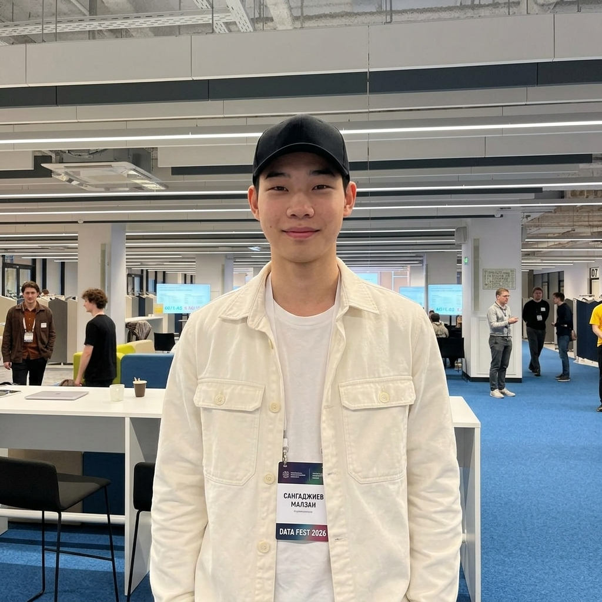
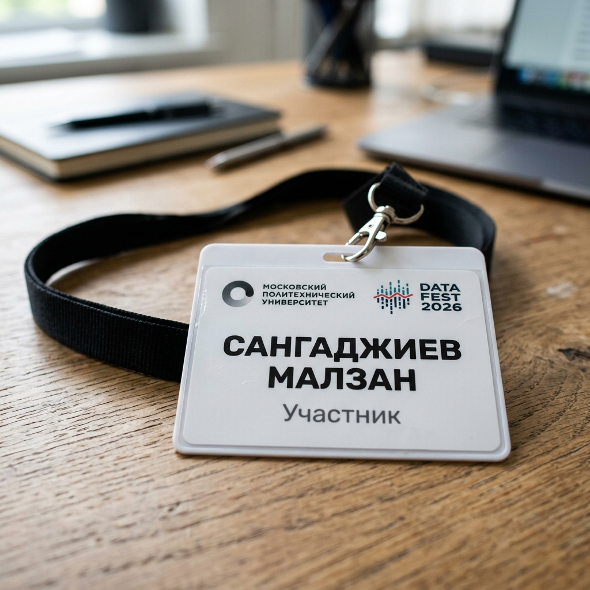

# Отчет о взаимодействии с партнерами и участии в DataFest 2026

## 1. Введение и общие сведения

Взаимодействие с профильной индустрией и участие в научно-практических мероприятиях является важнейшей частью проектной практики студентов Московского Политеха. Это позволяет сопоставить академические знания с реальными требованиями рынка труда, ознакомиться с передовыми технологиями и интегрировать лучшие индустриальные практики в разрабатываемый проект.

В ходе выполнения практики студент группы 251-951 **Сангаджиев Малзан Гаряевич** принял очное участие в крупнейшей ежегодной конференции по анализу данных в СНГ — **DataFest 2026** (проходившей в Москве в апреле 2026 года), а также посетил мероприятия **Карьерного марафона Московского Политеха**.

---

## 2. Участие в конференции DataFest 2026

Конференция DataFest объединяет ведущих специалистов в области Data Science, Machine Learning, искусственного интеллекта и смежных дисциплин. Очное участие в конференции было направлено на поиск технологических решений для социологического мониторинга и анализа оценок ППС.

### 2.1. Посещенные тематические секции и доклады

1.  **Секция «NLP и анализ отзывов в сфере EdTech»**
    *   *Содержание докладов:* Рассматривались методы автоматической обработки естественного языка (Natural Language Processing) для анализа обратной связи от студентов. Докладчики делились опытом предобработки текстов, борьбы с сарказмом и неформальной лексикой в отзывах, а также применения нейросетей семейства BERT для классификации тональности на русском языке.
    *   *Связь с проектом:* Полученные знания легли в основу концепции обработки открытых комментариев студентов о преподавателях, разрабатываемой в нашем проекте. Было решено использовать модель `rubert-base-cased-sentiment` для автоматического анализа отзывов.
2.  **Секция «Прикладная статистика и социологические исследования»**
    *   *Содержание докладов:* Были представлены кейсы по математической обработке результатов опросов населения и студентов. Особое внимание уделялось борьбе с систематическими ошибками выборки (selection bias), методам нормирования оценок и расчету взвешенных рейтингов.
    *   *Связь с проектом:* На основе докладов секции был доработан алгоритм расчета интегрального рейтинга преподавателей ($R_{total}$) с учетом весов различных критериев, а также внедрен статистический анализ дисперсии для выявления разногласий в оценках студентов.
3.  **Секция «Интерфейсы аналитических систем (BI & Data Visualization)»**
    *   *Содержание докладов:* Эксперты по визуализации данных рассказывали о принципах проектирования пользовательских интерфейсов для дашбордов, правилах выбора типов диаграмм в зависимости от характера данных и методах повышения юзабилити (UX) аналитических панелей.
    *   *Связь с проектом:* Полученные рекомендации по UI/UX были переданы Frontend-разработчику Смирновой Дарье и применены при создании страниц аналитического дашборда на сайте проекта.

### 2.2. Иллюстрации участия

Ниже представлены фотографии, подтверждающие очное присутствие на конференции DataFest 2026:

**Рисунок 1. Сангаджиев Малзан Гаряевич на площадке проведения DataFest 2026:**

**Рисунок 2. Именной бейдж участника конференции:**

---

## 3. Карьерный марафон Московского Политеха

Помимо научной конференции, в апреле 2026 года было принято участие в ежегодном Карьерном марафоне Московского Политеха.

### 3.1. Основные активности
*   **Стенд-сессии с работодателями:** Проведены встречи с представителями ведущих IT-компаний (Яндекс, Сбер, VK, Лаборатория Касперского). Обсуждались возможности прохождения летних стажировок в отделах аналитики данных и социологических исследований.
*   **Мастер-класс по резюме:** Было пройдено индивидуальное ревью резюме с HR-специалистами Сбера. Получены рекомендации по позиционированию навыков анализа данных (Python, SQL, математическая статистика) и описанию опыта проектной деятельности вуза.
*   **Презентация кейсов компаний:** Посещена презентация кейса от компании VK по исследованию удовлетворенности пользователей (UX-исследования). Методы, применяемые VK для оценки удовлетворенности продуктом, оказались концептуально близки к методологиям социологического мониторинга преподавателей вуза.

---

## 4. Заключение и выводы

Участие в DataFest 2026 и Карьерном марафоне позволило решить следующие ключевые задачи практики:
1.  **Технологический стек:** Сформирован современный стек технологий для обработки данных социологического мониторинга (Python, Pandas, Transformers, Chart.js).
2.  **Профессиональные контакты:** Получены контакты специалистов в области Data Science, с которыми обсуждались подходы к автоматизации оценки ППС.
3.  **Карьерное развитие:** Составлен индивидуальный план развития навыков, необходимых для прохождения стажировок на позициях Data Analyst / Data Scientist.
