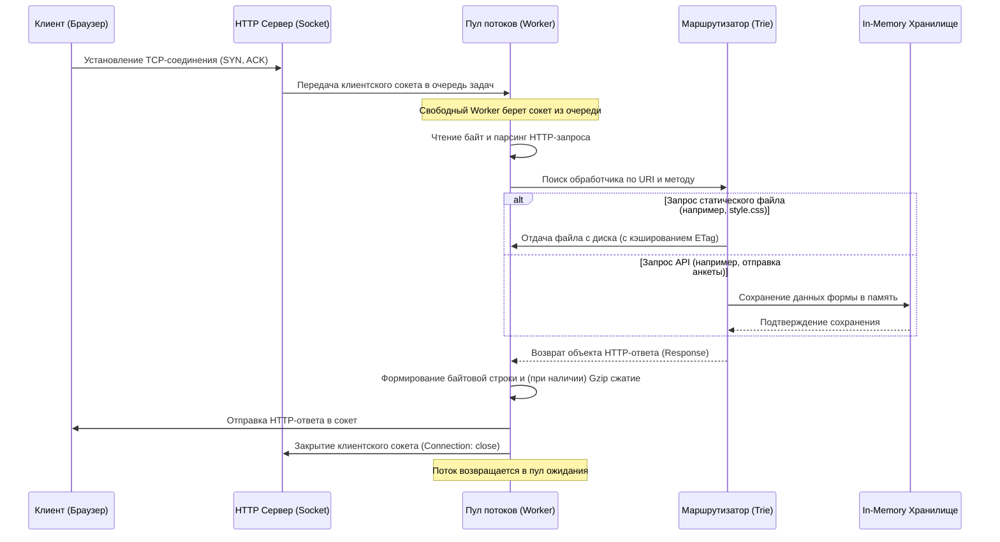

# Техническое руководство по разработке HTTP-сервера с нуля на Python

В данном документе описывается архитектура, процесс проектирования и реализация собственного легковесного многопоточного веб-сервера, созданного в рамках вариативной части учебной практики.

---

## 1. Введение и архитектура сервера

Создание HTTP-сервера с нуля позволяет глубоко понять работу протоколов прикладного и транспортного уровней (HTTP и TCP), особенности управления ресурсами операционной системы через сокеты и механизмы параллельных вычислений.

Сервер построен по классической схеме с блокирующими сокетами и пулом рабочих потоков (Thread Pool). Такая архитектура обеспечивает баланс между простотой реализации и высокой производительностью при обслуживании статических веб-страниц и простых API-интерфейсов.

### Схема обработки соединения (Flow Diagram)

---

## 2. Ключевые компоненты системы

Программа спроектирована в объектно-ориентированном стиле и разделена на изолированные классы:

### 2.1. Класс HTTPStatus
Представляет собой перечисление (Enum), содержащее коды состояния HTTP (200 OK, 301, 400, 403, 404, 405, 500) и их текстовые описания.

### 2.2. Класс Request
Отвечает за парсинг сырого потока байтов из сокета:
*   Разбиение заголовков по границе `\r\n\r\n` на стартовую строку, заголовки и тело.
*   Парсинг стартовой строки (Метод, URI, Версия HTTP).
*   Парсинг строки параметров запроса (Query String) и их декодирование.
*   Парсинг заголовков и извлечение Cookies.
*   Парсинг тела запроса (включая поддержку `application/x-www-form-urlencoded` и `multipart/form-data`).

### 2.3. Класс Response
Отвечает за формирование корректного HTTP-ответа:
*   Автоматический расчет заголовка `Content-Length`.
*   Управление заголовками кэширования (`ETag`, `Cache-Control`, `Last-Modified`).
*   Сжатие тела ответа методом Gzip, если клиент передал заголовок `Accept-Encoding: gzip`.
*   Поддержка отправки частичного контента (HTTP 206 Partial Content) по заголовку `Range` для потокового видео и аудио.

### 2.4. Префиксный маршрутизатор (Trie Router)
Для быстрого и гибкого поиска обработчиков путей реализован роутер на основе префиксного дерева (Trie). Он поддерживает:
*   Регистрацию статических маршрутов (например, `/about`).
*   Маршруты с динамическими параметрами (например, `/api/teachers/<id:int>`).
*   Привязку к конкретным HTTP-методам.
*   Защиту от выхода за пределы корневой папки (Directory Traversal Vulnerability) путем проверки нормализованного абсолютного пути.

---

## 3. Реализованные улучшения (Модификации)

В отличие от простейшего веб-сервера, обрабатывающего один запрос в одном цикле, в данный проект были заложены продвинутые механизмы:

1.  **Пул потоков (Thread Pool):** Предотвращает накладные расходы на создание и уничтожение потоков ОС при каждом запросе. Размер пула настраивается в конфигурации (по умолчанию — 16 рабочих потоков).
2.  **Сжатие Gzip:** Уменьшает объем передаваемого трафика для текстовых ресурсов (HTML, CSS, JS) в 3–5 раз, значительно увеличивая скорость загрузки страниц.
3.  **Range Requests:** Позволяет браузеру запрашивать определенные диапазоны байтов файлов. Это необходимо для корректного воспроизведения медиафайлов и возможности перемотки видео на сайте.
4.  **Умное кэширование:** Реализована поддержка хэш-сумм файлов (`ETag`). Если файл на сервере не менялся, сервер возвращает статус `304 Not Modified` без повторной отправки тела файла.
